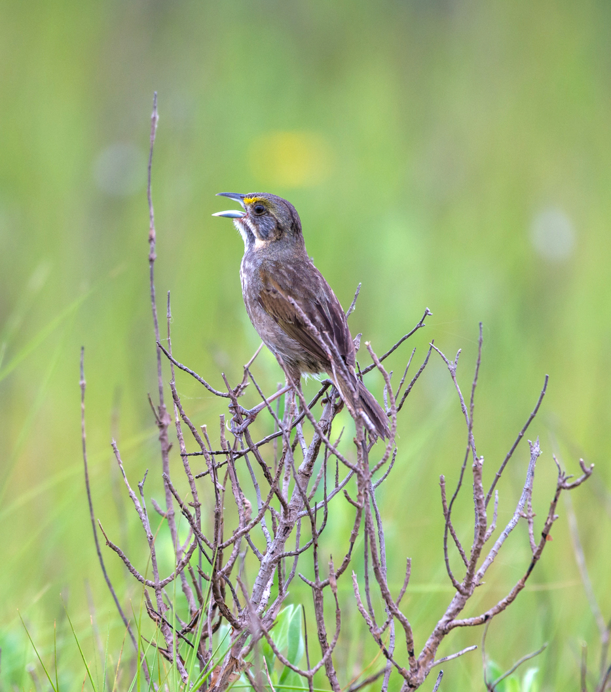
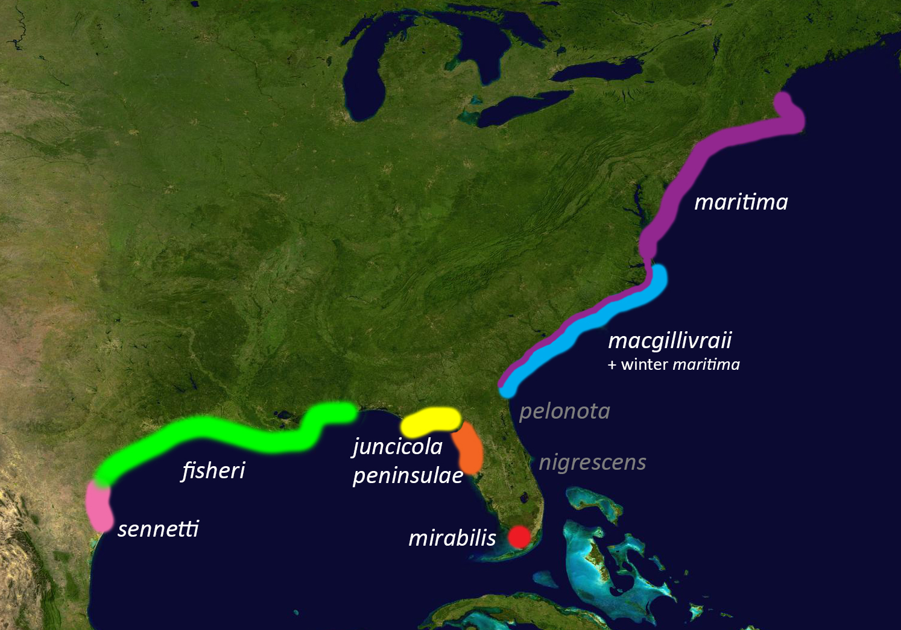
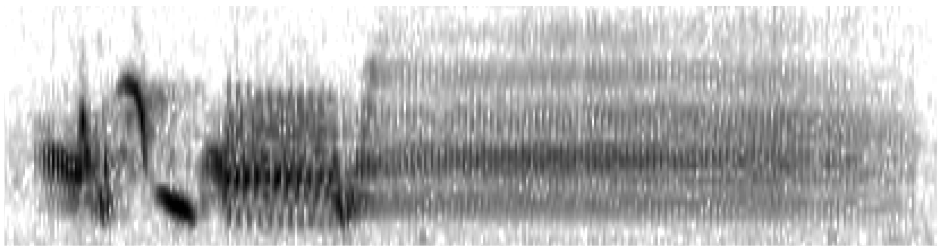
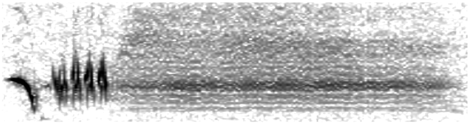
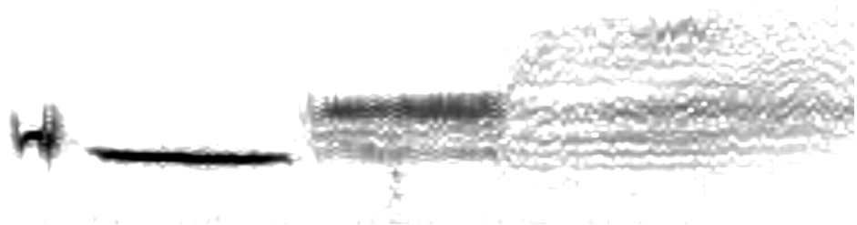

........................................................................................................

## <u>Background</u>



  The Seaside Sparrow is a grassland obligate species that is restricted to saltmarsh habitats along the Atlantic and Gulf coasts of the United States. These birds are saltmarsh specialists and the habitat they occupy is highly fragmented and non-contiguous throughout their range. The Seaside sparrow is a non-migratory Passerine species with the exception of the *Ammospiza maritima maritima* subspecies which is known to migrate south along the Atlantic coastline during the winter and return north in the spring. 

  There are currently seven described subspecies of Seaside Sparrow: *A.m. maritima*, *A.m. macguilivraii*, *A.m. mirabilis*, *A.m. peninsulae*, *A.m. juncicola*, *A.m. fisheri*, and *A.m. sennetti*. The current subspecies designation is based largely on plumage morphology, though there is a great deal of debate over the accuracy of these designations and a number of genetic examinations are underway to examine the relatedness of these subspecies. Existing literature has already determined that subspecies are more closely related to subspecies on the same coastline (Atlantic and Gulf), Leading to the acknowledgment of two <b>coastal lineages</b> of the Seaside Sparrow.



  This research was conducted to examine if song or song elements in the song of the Seaside Sparrow vary geographically, and if observable variation aligns with current subspecies designations.
  
  Geographic variation in song is common in temperate passerines, but previous studies exploring song variation in Seaside Sparrows have not examined song at a range-wide scale. We analyzed the song structure of nine subspecies of Seaside Sparrow to describe how song varies geographically and ask whether variation in song structure aligns with currently described subspecies designations. For this study we gathered songs from the collections of the Macaulay Library, Borror Institute of Sound, Florida Natural History Museum, and Xeno-Canto, and also recorded songs at several sites in Texas.
  
  Seaside Sparrows have a song repertoire of between one and four songs and sing only a single song type. The song of the Seaside Sparrow has a distinctive two-part structure consisting of an introductory phrase, composed of a warble containing a variety of syllables, followed by a terminal buzz. Song components within the introductory phrase of the song are highly variable, while the terminal buzz is a consistent feature throughout the species range. 
  
  Eight descriptive measures of song were recorded for the introduction and the terminal buzz. We also recorded the total number of syllables in the introduction, and the rate at which the terminal buzz was delivered. Finally, each syllable from every song was categorized into one of six syllable types, then grouped by specific identity within each type.
  
  Below are three spectogram showing the Seaside Sparrow song from three locations throughout its range. Each Spectogram has an associated audio file of the displayed song. 
  
     

  Using ANOVA and PCAs we explored if songs clustered geographically or by subspecies based on elements of song structure or syllable identity.  
  
## <u>Range, collection sites, and distribution of song recordings</u>

  For this study I used a combination of field recordings and archived recordings from various digital archives. Below is a map showing the origin location of all of the recordings used for this project. For this first map songs are clustered by location and will separate out the farther the map is zoomed in. Additionally, clicking on a specific point will show which subspecies is associated with the song.  

```{r echo=FALSE, message=FALSE, warning=FALSE}
Song_Data <- read_excel("Song-Data_v7.xlsx", 
    sheet = "Main Data Sheet") %>% slice(11:424)


pal <- colorFactor(c("pink","red","orange","yellow","green","blue","purple"), domain = c("sennetti","fisheri","juncicola","peninsulae","mirabilis","macgillivraii","maritima"))

leaflet(Song_Data) %>% 
  addTiles() %>% addMarkers(~Longitude, ~Latitude, popup = Song_Data$Subspecies, label = Song_Data$Susbpecies, clusterOptions = markerClusterOptions())
 
```

## <u>Measurements and song variables</u>

  For this analysis I recorded eight song variables for each the Seaside Sparrow songs in my data set. These variables were the <b>Total Number of Syllables (SC)</b>, <b>Introductory Phrase Duration (I_D)</b>, <b>Terminal Buzz Duration (TB_D)</b>, <b>Total Song Duration (S_D)</b>, <b>Terminal Buzz Maximum Frequency (TB_MaF)</b>, <b>Terminal Buzz Minumum Frequency (TB_MiF)</b>, <b>Terminal Buzz Mean Frequency (TB_MeF)</b>, and <b>Terminal Buzz Rate (TB_Pps)</b>.
```{r message=FALSE, warning=FALSE, include=FALSE}
library(ggplot2)
library(viridis)
library(grid)
library(gridExtra)
library(dplyr)
library(tidyr)
library(ggfortify)
library(pwr)
library(readxl)
library(leaflet)
SAC_reduced <- read_excel("SAC_reduced.xlsx")
Multi_variate_reduced <- read_excel("Multi-variate_reduced.xlsx")
local_dispersed_counts <- read_excel("local_dispersed_counts.xlsx")
Syllable_accum <- read_excel("Syllable_accum.xlsx")
```

## <u>Examination of variables for correlation</u>

  Using a Pearson's correlation test I examined my variables for strong correlation in order to remove redundant variables from my dataset. To do this I looked for values greater than 0.80 correlation from within my variables. Only the <b>Terminal Buzz Maximum Frequency</b> and the <b>Terminal Buzz Minimum Frequency</b> had a correlation greater than 0.80. I removed <b>Terminal Buzz Mean Frequency</b> from my analysis. I also removed <b>Total Song Duration</b> from the analysis as differences in <b>Introductory Phrase Duration</b> and <b>Terminal Buzz Duration</b> will reflect differences in <b>Total Song Duration</b> and thus is a redundant variable for this analysis.
```{r echo=FALSE, message=FALSE, warning=FALSE}
Basic.1 <- SAC_reduced %>% select(6:13) %>% na.omit()

library("Hmisc")

res2 <- rcorr(as.matrix(Basic.1))
res2 

```

## <u>ANOVA between subspecies</u> 

  Next, I ran an ANOVA on the remaining variables. Based on the P-values returned from this analysis, all of the remaining variables showed significant variation between subspecies groups.
```{r echo=FALSE, message=FALSE, warning=FALSE}
library(knitr)
library(kableExtra)

Basic1 <- Basic %>% na.omit()

lm_basic <- lm(Subspecies_code ~ SC + TB_D + I_D + TB_Pps + TB_MaF + TB_MiF, data = Basic1)

a.lm.basic <- anova(lm_basic)

a.lm.basic %>% kable() %>% kable_styling()
```

## <u>Principle component analysis: clustering by subspecies</u>

  Next I ran a PCA using the significant variables from the ANOVA to examine if songs were clustering by subspecies, based on significant song variables. Unfortunately little can be determined from this PCA plot other than that there is no clear separation by subspecies given the significant variables.

  For each of the dimensions used to form the axis for the PCA plot a bar-plot was generated showing the contribution of each variable within the dimension. The red line on each of these plots represents the value that all variables would be at if they were contributing equally.  
```{r echo=FALSE, message=FALSE, warning=FALSE}
library("devtools")
library("factoextra")
library(e1071)
require(caret)

Basic <- Basic %>% na.omit()
Basic_1 <- Basic %>% select(6,7,10:13)

ssp.pca1 <- prcomp(Basic_1, center = TRUE, scale = TRUE)

pca.plot1 <- fviz_pca_biplot(ssp.pca1, label = "var", axes = c(1, 2), geom = c("point", "text"), 
                          habillage = Basic$Subspecies, addEllipses = T, 
                          ellipse.level = 0.95) + scale_color_manual(values = c("fisheri" = "#5DC863FF", "sennetti" = "#B4DE2CFF", "juncicola" = "#440154FF", "peninsulae" = "#21908CFF", "maritima" = "#3B528BFF"))+ theme(plot.title = element_text(hjust = 0.5))

print(pca.plot1)

dim1 <- fviz_contrib(ssp.pca1, choice="var", axes=1)+labs(title="Contributions to Dimension 1 (x-axis)")+ theme(plot.title = element_text(hjust = 0.5))
dim2 <- fviz_contrib(ssp.pca1, choice="var", axes=2)+labs(title="Contributions to Dimension 2 (y-axis)")+ theme(plot.title = element_text(hjust = 0.5))
grid.arrange(dim1, dim2, nrow = 1, top = "Varible Weights Within Principle Components")
```

## <u>Subspecies boxplots</u>

  To more clearly visualize the variation between subspecies I constructed boxplots for each significant variable from the ANOVA. The subspecies in each plot are arranged along a longitudinal gradient with the westmost subspecies on the left and the east-most subspecies on the right. In this way a trendline can be fit to examine if there is a longitudinal gradient associated with any visible variation.  

  Using these plots we can see that variation is present in each variable. However, only the <b>Total Number of Syllables</b>, and the <b>Terminal Buzz Maximum Frequency</b> show clear separation between subspecies groups. We do see some slight longitudinal trends in several of the variables examined.  
```{r echo=FALSE, message=FALSE, warning=FALSE}
Basic <- SAC_reduced

Basic$Subspecies <- factor(Basic$Subspecies, levels = c('sennetti','fisheri','juncicola','peninsulae','maritima'), ordered = TRUE)

b1 <- ggplot(Basic, aes(x=Subspecies, y=SC)) + geom_boxplot(aes(fill = Basic$Subspecies))+ theme_bw() + theme(legend.position = "none") + xlab("Subspecies") + ylab("Syllable Count") + scale_fill_manual(values = c("fisheri" = "#5DC863FF", "sennetti" = "#B4DE2CFF", "juncicola" = "#440154FF", "peninsulae" = "#21908CFF", "maritima" = "#3B528BFF"))
b2 <- ggplot(Basic, aes(x=Subspecies, y=TB_D)) + 
  geom_boxplot(aes(fill = Basic$Subspecies)) + theme_bw() + theme(legend.position = "none") + xlab("Subspecies") + ylab("Terminal Buzz Duration (sec)") + scale_fill_manual(values = c("fisheri" = "#5DC863FF", "sennetti" = "#B4DE2CFF", "juncicola" = "#440154FF", "peninsulae" = "#21908CFF", "maritima" = "#3B528BFF"))
b3 <- ggplot(Basic, aes(x=Subspecies, y=I_D)) + 
  geom_boxplot(aes(fill = Basic$Subspecies)) + theme_bw() + theme(legend.position = "none") + xlab("Subspecies") + ylab("Indroductory phrase duration (sec)") + scale_fill_manual(values = c("fisheri" = "#5DC863FF", "sennetti" = "#B4DE2CFF", "juncicola" = "#440154FF", "peninsulae" = "#21908CFF", "maritima" = "#3B528BFF"))
b4 <- ggplot(Basic, aes(x=Subspecies, y=TB_Pps)) + 
  geom_boxplot(aes(fill = Basic$Subspecies)) + theme_bw() + theme(legend.position = "none") + xlab("Subspecies") + ylab("Terminal Buzz Rate (peaks/sec)") + scale_fill_manual(values = c("fisheri" = "#5DC863FF", "sennetti" = "#B4DE2CFF", "juncicola" = "#440154FF", "peninsulae" = "#21908CFF", "maritima" = "#3B528BFF"))
b5 <- ggplot(Basic, aes(x=Subspecies, y=TB_MaF)) + 
  geom_boxplot(aes(fill = Basic$Subspecies)) + theme_bw() + theme(legend.position = "none") + xlab("Subspecies") + ylab("Terminal Buzz Maximum Frequency (kHz)") + scale_fill_manual(values = c("fisheri" = "#5DC863FF", "sennetti" = "#B4DE2CFF", "juncicola" = "#440154FF", "peninsulae" = "#21908CFF", "maritima" = "#3B528BFF"))
b6 <- ggplot(Basic, aes(x=Subspecies, y=TB_MiF)) + 
  geom_boxplot(aes(fill = Basic$Subspecies)) + theme_bw() + theme(legend.position = "none") + xlab("Subspecies") + ylab("Terminal Buzz Minimum Frequency (kHz)") + scale_fill_manual(values = c("fisheri" = "#5DC863FF", "sennetti" = "#B4DE2CFF", "juncicola" = "#440154FF", "peninsulae" = "#21908CFF", "maritima" = "#3B528BFF"))

B1 <- b1 + ggtitle("Number of Syllables") + theme(plot.title = element_text(hjust = 0.5)) +
    geom_jitter(color="black", size=0.1, alpha=0.9) +geom_smooth(method = "lm", se=FALSE, color="red", aes(group=1))
B2 <- b2 + ggtitle("Terminal Buzz Duration") + theme(plot.title = element_text(hjust = 0.5)) +
    geom_jitter(color="black", size=0.1, alpha=0.9) +geom_smooth(method = "lm", se=FALSE, color="red", aes(group=1))
B3 <- b3 + ggtitle("Indroductory Phrase Duration") + theme(plot.title = element_text(hjust = 0.5)) +
    geom_jitter(color="black", size=0.1, alpha=0.9) +geom_smooth(method = "lm", se=FALSE, color="red", aes(group=1))
B4 <- b4 + ggtitle("Terminal Buzz Rate") + theme(plot.title = element_text(hjust = 0.5)) +
    geom_jitter(color="black", size=0.1, alpha=0.9) +geom_smooth(method = "lm", se=FALSE, color="red", aes(group=1))
B5 <- b5 + ggtitle("Terminal Buzz Maximum Frequency") + theme(plot.title = element_text(hjust = 0.5)) +
    geom_jitter(color="black", size=0.1, alpha=0.9) +geom_smooth(method = "lm", se=FALSE, color="red", aes(group=1))
B6 <- b6 + ggtitle("Terminal Buzz Minimum Frequency") + theme(plot.title = element_text(hjust = 0.5)) +
    geom_jitter(color="black", size=0.1, alpha=0.9) +geom_smooth(method = "lm", se=FALSE, color="red", aes(group=1))

grid.arrange(B1, B4, nrow = 1)
grid.arrange(B2, B3, nrow = 1)
grid.arrange(B5, B6, nrow = 1)
```

## <u>Syllable identification and distribution: localized and broadly dispersed syllables</u>

  The next step was to examine and describe syllable identities for each syllable for all songs in the dataset.

  Each syllable was binned into one of six syllable groups: <b>Buzz syllables</b>, <b>Complex syllables</b>, <b>Trill syllables</b>, <b>Whistle syllables</b>, <b>Whistle-buzz syllables</b>, and <b>Whistle-trill syllables</b>. Once grouped by type, each syllable was measured and compared by shape to determine individual identities based on morphology, duration (sec), and frequency range (kHz). <b>215 syllables</b> were described using this method. 

  I used a "minimum occurrence" threshold of <b>four</b> occurrences of a specific syllable within the dataset for the syllable to be included in the analysis. This was done to weed out possible outliers and improvisations. The threshold was determined by taking an average of the number of songs recorded at a given location and corroborated using a power analysis. Of the 215 described in the dataset, <b>67 syllables</b> passed the minimum occurrence threshold and were used in the analysis.

  I then plotted the resulting syllables based on their latitude and longitude, and colored them by the subspecies song that the syllable was recorded in. This was done to examine if syllables occurred in highly localized instances, restricted geographically to a small area or a single subspecies, or if the syllables were highly dispersed across the entire range of the Seaside Sparrow.

  Below are examples of localized and dispersed syllables from within the data set, as well as a bar graph showing the percentage of localized and dispersed syllables in the dataset. We can see from this graph that only <b>~25%</b> of the syllables were localized, while <b>~75%</b> where dispersed. 
```{r message=FALSE, warning=FALSE, include=FALSE}
library(ggplot2)
library(dplyr)
library(tidyr)
library(ggfortify)
library(pwr)

Basic.note <- Basic %>% select(14:228)
Basic.note %>% colSums()
count(Basic, vars = Basic$Region_M)

pwr.anova.test(k = 353, f = 0.15, sig.level = .05, power = .8)
```
```{r echo=FALSE, message=FALSE, warning=FALSE}
Complete_SSP <- Multi_variate_reduced

states <- map_data("state")
Coast_set <- subset(states, region %in% c("maine","new hampshire","massachusetts","connecticut",
                                          "new york","new jersey","delaware","maryland","virginia",
                                          "north carolina","south carolina","georgia","florida",
                                          "alabama","mississippi","louisiana","texas","rhode island"))

SSP.df.Disp <- Complete_SSP %>% slice(46:62, 548:601, 1456:1466)

Disp.all <- ggplot(SSP.df.Disp, aes(x = Longitude, y = Latitude, colour = Subspecies)) + ggtitle("Example of Dispersed Syllables") +
  geom_point(alpha = 0.1) + geom_point(size = 0.1) + xlim(-110,-65) + ylim(25,50) + scale_colour_discrete(drop=TRUE, limits = levels(Complete_SSP$Subspecies)) + theme_bw() + theme(legend.position="bottom") + geom_polygon(data = Coast_set, aes(x=long, y = lat, group = group), fill = NA, color = "black") + coord_fixed(1.3) + facet_wrap(~S_ID)

Disp.all + theme(plot.title = element_text(hjust = 0.5)) + geom_jitter(width = 0.5, height = 0.5) + scale_color_manual(values = c("fisheri" = "#5DC863FF", "sennetti" = "#B4DE2CFF", "juncicola" = "#440154FF", "peninsulae" = "#21908CFF", "maritima" = "#3B528BFF"))

# Note Complexes #####################################################################

SSP.df.Local <- Complete_SSP %>% slice(c(727:737, 1053:1058, 744:757))

Local.all <- ggplot(SSP.df.Local, aes(x = Longitude, y = Latitude, colour = Subspecies)) + ggtitle("Example of Localized Syllables") +
  geom_point(alpha = 0.1) + geom_point(size = 0.1) + xlim(-110,-65) + ylim(25,50) + scale_colour_discrete(drop=TRUE, limits = levels(Complete_SSP$Subspecies)) + theme_bw() + theme(legend.position="bottom") + 
  geom_polygon(data = Coast_set, aes(x=long, y = lat, group = group), fill = NA, color = "black") + 
  coord_fixed(1.3) + facet_wrap(~S_ID)

Local.all + theme(plot.title = element_text(hjust = 0.5)) + geom_jitter(width = 0.5, height = 0.5) + scale_color_manual(values = c("fisheri" = "#5DC863FF", "sennetti" = "#B4DE2CFF", "juncicola" = "#440154FF", "peninsulae" = "#21908CFF", "maritima" = "#3B528BFF"))

L.D.count <- local_dispersed_counts

(ggplot(L.D.count, aes(Dispersal, fill=Dispersal))
 + geom_bar()
 + geom_text(
     aes(label=round((..prop..)*100,2), group=1),
     stat='count',
     nudge_y=2,
     va='bottom',
     format_string='{:.1f}%'
 )
) + scale_fill_manual(values = c("Dispersed" = "#3B528BFF", "Localized" = "#5DC863FF")) + labs(x="Dispersal", y="Percentage of Syllables", title = "Ratio of Dispersed and Localized Syllables")+ theme(plot.title = element_text(hjust = 0.5))
```

## <u>Coastal lineages: how does changing perspective change the story?</u>

  From this point I wanted to see if a broader pattern better described the observable variation in the data set. To examine this I wanted to know: <b>Does Geographic variation exist between the two coastal lineages of Seaside Sparrow subspecies?</b>

  First, I re-ran my initial ANOVA using the <b>Atlantic</b> and <b>Gulf</b> regions rather than subspecies groups to determine if the significance of my variables had changed based on this alternate method of grouping songs. Once songs were grouped by coastal lineage, the p-values of the <b>Terminal Buzz Rate</b> and <b>Terminal Buzz Minimum Frequency</b> were greater than 0.05 and removed for the next analysis. 
```{r echo=FALSE, message=FALSE, warning=FALSE}
lm_basic2 <- lm(Region_code ~ SC + TB_D + I_D + TB_Pps + TB_MaF + TB_MiF, data = Basic1)

a.lm.basic2 <- anova(lm_basic2)

a.lm.basic2 %>% kable() %>% kable_styling()
```

## <u>Coastal lineage principle component analysis</u>

  I re-constructed the PCA plot using the coastal lineages and, while there is still an area of overlap, there is a much clearer separation and clustering of data points between the two groups.

  Additionally, I constructed boxplots of the significant variables to examine if clear separation existed between the two coastal lineages for each significant variable.

  From these graphs we can see stronger separation between coastal lineages than between subspecies groups for each of the variables. In particular the <b>Total number of Syllables</b> and <b>Terminal Buzz Maximum Frequency</b> show strong separation. 
```{r echo=FALSE, message=FALSE, warning=FALSE}
Basic <- Basic %>% na.omit()
Basic_3 <- Basic %>% dplyr::select(6,7,10,12)

ssp.pca3 <- prcomp(Basic_3, center = TRUE, scale = TRUE)

pca.plot3 <- fviz_pca_biplot(ssp.pca3, axes = c(1, 2), geom = "point", 
                          habillage = Basic$Region_M, addEllipses = TRUE, 
                          ellipse.level = 0.95) + scale_colour_manual(values = c("Atlantic" = "#3B528BFF", "Gulf" = "#5DC863FF"))

print(pca.plot3)

dim1.1 <- fviz_contrib(ssp.pca3, choice="var", axes=1)+labs(title="Contributions to Dim 1")
dim2.1 <- fviz_contrib(ssp.pca3, choice="var", axes=2)+labs(title="Contributions to Dim 2")
grid.arrange(dim1.1, dim2.1, nrow = 1, top = "Varible Weights Within Principle Components")

b1 <- ggplot(Basic, aes(x=Region_M, y=SC)) + geom_boxplot(aes(fill = Basic$Region_M)) + theme_bw() + theme(legend.position = "none") + xlab("Coast Group") + ylab("Syllable Count") + scale_fill_manual(values = c("Atlantic" = "#3B528BFF", "Gulf" = "#5DC863FF")) + geom_jitter(color="black", size=0.1, alpha=0.9)
b2 <- ggplot(Basic, aes(x=Region_M, y=I_D)) + 
  geom_boxplot(aes(fill = Basic$Region_M)) + theme_bw() + theme(legend.position = "none") + xlab("Coast Group") + ylab("Introductory Phrase Duration (sec)") + scale_fill_manual(values = c("Atlantic" = "#3B528BFF", "Gulf" = "#5DC863FF")) + geom_jitter(color="black", size=0.1, alpha=0.9)
b3 <- ggplot(Basic, aes(x=Region_M, y=TB_D)) + 
  geom_boxplot(aes(fill = Basic$Region_M)) + theme_bw() + theme(legend.position = "none") + xlab("Coast Group") + ylab("Terminal Buzz Duration (sec)") + scale_fill_manual(values = c("Atlantic" = "#3B528BFF", "Gulf" = "#5DC863FF")) + geom_jitter(color="black", size=0.1, alpha=0.9)
b4 <- ggplot(Basic, aes(x=Region_M, y=TB_MaF)) + 
  geom_boxplot(aes(fill = Basic$Region_M)) + theme_bw() + theme(legend.position = "none") + xlab("Coast Group") + ylab("Terminal Buzz Maximum Frequency (kHz)") + scale_fill_manual(values = c("Atlantic" = "#3B528BFF", "Gulf" = "#5DC863FF")) + geom_jitter(color="black", size=0.1, alpha=0.9)
grid.arrange(b1, b4, nrow = 1, top = "Box Plots For Song Characteristics Between Gulf and Atlantic Groups") 
grid.arrange(b2, b3, nrow = 1, top = "Box Plots For Song Characteristics Between Gulf and Atlantic Groups") 
```

## <u>Syllable accumulation</u> 

  Finally, I wanted to look at the total accumulation of syllables determine if the 215 described syllables from my data set are a representative sampling of songs from throughout the range. In addition, I wanted to compare the rate of syllable accumulation between the two coastal lineages. 

  To do this I constructed an accumulation curve of syllables for the entire data set and overlaid it with an additional curve for each coastal lineage.

  What this shows is an overall accumulation curve that has not leveled off. this indicates that more song sampling would likely yield additional syllables throughout the species range. Additionally we see that the Atlantic lineage accrues more syllables than the Gulf lineage at equal points on the graph. The Atlantic lineage also contains nearly as many syllables as the Gulf. These findings are interesting given that the Gulf lineage had a higher number of syllables per song. This would indicate that the Gulf lineage songs have a higher occurrence of repeat syllables in each song. 
```{r echo=FALSE, message=FALSE, warning=FALSE}
library(vegan)
library(readxl)

sac_SSP <- Syllable_accum
total.syllables <- specaccum(sac_SSP, method = "random", permutations = 1000, conditioned =TRUE, gamma = "jack1",  w = NULL)


#subset each habitat into its own df
sac_SSP %>% filter(Region_M == 1) -> Atlantic
sac_SSP %>% filter(Region_M == 2) -> Gulf

#calc species accumulation curve for each habitat
Atlantic.coast = specaccum(Atlantic, method = "random", permutations = 1000)
Gulf.coast = specaccum(Gulf, method = "random", permutations = 1000)

#plot curve_all first
plot(total.syllables, xlab = "Number of songs analyzed", ylab = "Number of syllables", main = "Syllable Accumulation Curve", col = "gray") 
#then plot the rest
plot(Atlantic.coast, add = TRUE, col = "#3B528BFF") 
plot(Gulf.coast, add = TRUE, col = "#5DC863FF")
legend("bottomright", c("Total Syllables", "Atlantic", "Gulf"),col=c("black","#3B528BFF","#5DC863FF"),lty=1,bty='n',inset=0.025)
```


........................................................................................................


